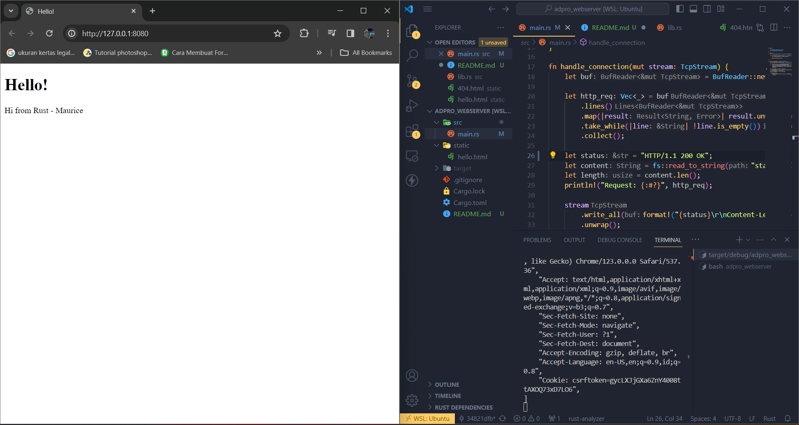
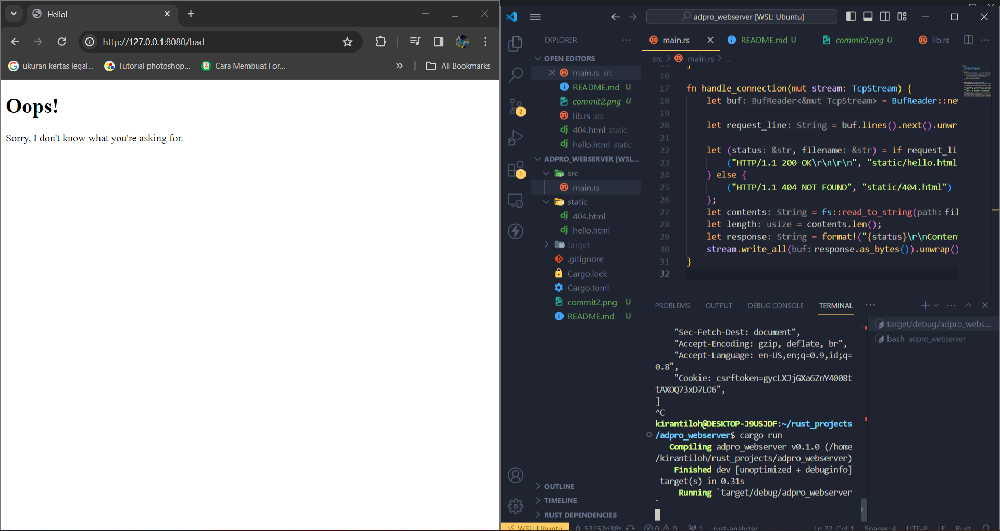

# Reflection
1. Fungsi `handle_connection()` membuat sebuah instance dari BufReader yang mengimplementasi trait `std::io::BufRead` sehingga setiap line dari buffer yang ada isi request masuk bisa dibaca. Setiap line di `.unwrap()` agar dapat hasil setiap line-nya (`.lines()` return Result`<String,  std::io::Error>` jadi perlu di `.unwrap()` biar bisa diambil stringnya) dan akan dilakukan selama masih ada isi, kemudian disatukan menjadi 1 `Vec<_>` http_request yang isinya berupa request yang masuk baris per baris.

2. 

3. Refactoring penting karena dengan approach sebelumnya kita banyak duplikasi kode ketika menentukan status, membuka file yang benar, dan format isinya. Dengan menggunakan pattern matching kita bisa menentukan status dan file yang benar untuk dibuka, lalu hanya perlu melakukan logic pembukaan file dan penulisan response 1 kali.

4. Karena dengan sistem sebelumnya hanya terdapat `main thread` untuk proses request yang masuk. Jika thread main sedang sibuk proses request, request berikutnya akan ditahan dalam queue sebelum diproses.

5. ThreadPool bekerja dengan menjadi tempat penyimpanan thread yang jumlahnya dapat disesuaikan ketika membuat sebuah ThreadPool. ThreadPool juga menjadi pembatas jumlah thread yang dapat dimunculkan agar tidak melebihi jumlah yang telah ditentukan.
